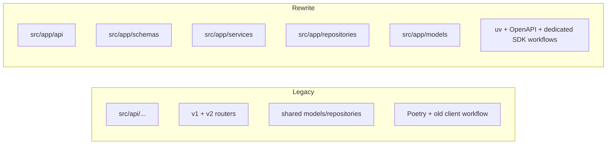
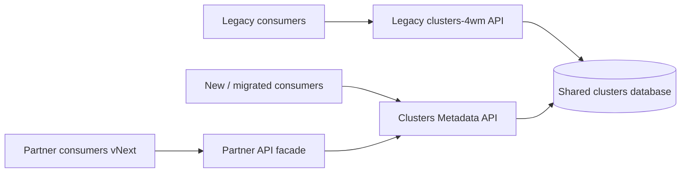
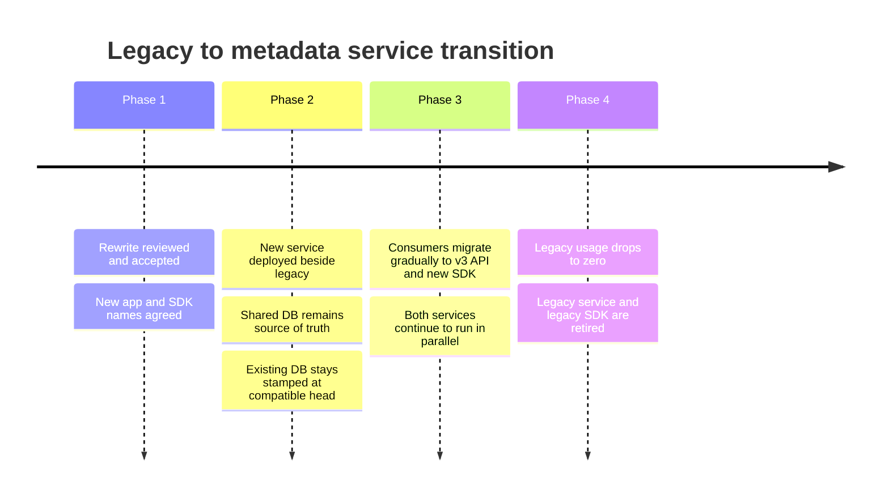

# Clusters Metadata Rewrite Review

## Executive Summary

This branch promotes the rewrite to the new canonical service identity:

- App name: `Clusters Metadata API`
- SDK name: `clusters-metadata-sdk`

The rewrite keeps the managed-cluster metadata domain, but modernizes the codebase, packaging, deployment shape, and API contract workflow. The legacy `clusters-4wm` service and the new metadata service are expected to run in parallel for a transition period while consumers migrate to the new API and SDK.

The review goal is to confirm:

- the new service identity and scope
- the technical differences vs legacy
- the database and migration strategy
- the parallel-run rollout plan
- the consumer migration approach

## Proposed Naming

| Area | Legacy | Proposed Canonical Name |
| --- | --- | --- |
| Application | `clusters-4wm` | `clusters-metadata-api` |
| API title | `Clusters 4WM API` | `Clusters Metadata API` |
| Generated SDK repo | `clusters-4wm-client` | `clusters-metadata-sdk` |
| Python package | `clusters_4wm_client` | `clusters_metadata_sdk` |

Why this naming:

- it describes the product as the canonical metadata service, not as an implementation detail of the legacy app
- it aligns the app, chart, OpenAPI title, and SDK publication flow
- it gives consumers a clear target during migration

## What Changed

### High-level changes

- legacy package layout under `src/api/...` was replaced with a new `src/app/...` structure
- the service is now organized around explicit layers:
  - `api`
  - `schemas`
  - `services`
  - `repositories`
  - `models`
  - `core`
- the internal API and partner API now have separate entrypoints:
  - `src/app/main.py`
  - `src/app/partner.py`
- OpenAPI and SDK generation are now first-class workflows in the repo
- the Helm chart was renamed from `clusters-4wm` to `clusters-metadata-api`
- legacy migration history was replaced by a single baseline migration in the rewrite branch

### Before vs after



## Architecture and Runtime Model

### Legacy runtime

- one legacy repo identity: `clusters-4wm`
- internal and partner APIs were exposed from the legacy source tree
- local development used `docker-compose.yaml`
- local/dev bootstrap used an explicit `init_db` container with `poetry run alembic upgrade head`

### Rewrite runtime

- new repo identity: `clusters-metadata-api`
- internal API entrypoint: `app.main:app`
- partner API entrypoint: `app.partner:app`
- local development uses `compose.yaml`
- Dockerfile now builds explicit targets:
  - `m4w`
  - `partner`
  - `m4w-dev`
  - `partner-dev`

### Request flow during transition



## Database and Migration Strategy

### Legacy state

- the legacy service has a long Alembic chain from `2022_09_04-305ae638786e_init.py` through the most recent head
- the legacy head revision is `a1b2c3d4e5f6` (`2026_05_19-a1b2c3d4e5f6_v3_schema_fixes`)
- existing deployed databases are already stamped with that legacy Alembic head

### Rewrite state

- the rewrite branch intentionally collapses the migration history into one baseline file:
  - `migrations/versions/2026_05_19-a1b2c3d4e5f6_baseline.py`
- that file uses the same revision id as the legacy head:
  - `revision = "a1b2c3d4e5f6"`

### Deploy sequencing (must hold for the no-op to be safe)

1. Roll out the co-patched legacy code (clusterlock keyed by `cluster_id`,
   kubedownscaler fields dropped, `feature.type` coercion) to **all** replicas.
2. Apply the legacy `a1b2c3d4e5f6` migration to the shared DB. Before doing so,
   verify there are no orphan locks (`clusterlock` rows whose `cluster_name`
   has no matching `cluster`), since the migration deletes them.
3. Confirm no pre-patch legacy instance is still serving.
4. Deploy the rewrite. Its baseline id equals the prod head, so
   `alembic upgrade head` is a no-op; the rewrite image carries `alembic` +
   `migrations/` only so fresh (never-stamped) environments can still bootstrap.

### Contract notes for the coexistence window

- Errors use RFC 7807 `application/problem+json` (top-level `type`/`title`/`status`/`detail`).
- Partner list endpoints return `200` with an empty list when nothing matches
  (legacy returned `404` — this is an intentional, documented partner-contract change).

Why this matters:

- if an environment already has `alembic_version = b06516d16522`, Alembic will treat the new branch as aligned to the current DB state
- this avoids replaying an entirely new rewrite-only revision id on top of an already-live schema

### Important migration rule during coexistence

For the months where both runtimes share the same database:

- schema changes must remain backward compatible with both services
- legacy and rewrite cannot diverge on incompatible DB assumptions
- any post-rewrite schema changes must be reviewed as shared-schema changes, not single-service changes

### How the migration from legacy to rewrite occurs

1. Existing environments keep the current database and current data.
2. The new service is deployed with the squashed baseline migration head aligned to the legacy head revision id.
3. `alembic upgrade head` on the rewrite branch recognizes the current DB as already aligned to head when the schema is already at the legacy state.
4. Legacy and rewrite run in parallel against the same schema.
5. After all consumers migrate, legacy can be retired.

### Migration timeline



## API Contract Changes

### Consumer-facing direction

- the new canonical API surface is the `/v3/...` contract
- new consumers should adopt the metadata API and metadata SDK directly
- existing legacy consumers can remain temporarily on the legacy runtime until scheduled migration

### Contract governance changes

- `openapi.json` is now checked in and treated as a review artifact
- CI validates freshness of the OpenAPI spec
- CI detects breaking API changes using `oasdiff`

This is a material improvement over the legacy flow because API evolution is now visible and reviewable in pull requests.

## Codebase and Engineering Changes

### Code structure

Legacy:

- `src/api/m4w/...`
- `src/api/partner/...`
- `src/api/shared/...`

Rewrite:

- `src/app/api/...`
- `src/app/core/...`
- `src/app/models/...`
- `src/app/repositories/...`
- `src/app/services/...`
- `src/app/schemas/...`

What this improves:

- clearer boundaries between transport, business logic, persistence, and schema models
- simpler onboarding for new contributors
- easier testing of services and repositories in isolation

### ORM and Alembic model organization

- the rewrite uses SQLAlchemy 2 declarative models under `src/app/models`
- `app.models` is now the model aggregation point for Alembic metadata discovery
- `migrations/env.py` can use the cleaner canonical pattern:

```python
from app.models import Base
target_metadata = Base.metadata
```

This keeps metadata discovery centralized and avoids making individual migration files depend on package-wide side effects.

### Tests

- tests were reorganized to match the rewrite structure
- rewrite tests focus on the current API and service layers
- legacy contract and integration test sprawl tied to the old layout was removed from the rewrite branch

## Tooling and Dependency Changes

| Area | Legacy | Rewrite |
| --- | --- | --- |
| Packaging/build | Poetry | `uv` |
| Lock file | `poetry.lock` | `uv.lock` |
| Build backend | `poetry-core` | `hatchling` |
| App package | `src/api` | `src/app` |
| Local compose file | `docker-compose.yaml` | `compose.yaml` |

### Key tooling shifts

- dependency sync now uses `uv sync`
- local commands use `uv run`
- Docker build uses `uv` in a multi-stage Dockerfile
- SDK generation now uses `openapi-python-client`

### Why it matters

- faster dependency resolution and leaner build flow
- clearer source packaging around the new app structure
- API contract and SDK generation are now part of the standard workflow

## Deployment and Operations Changes

### Helm/chart changes

- chart name changed from `clusters-4wm` to `clusters-metadata-api`
- application version reset to the rewrite line (`3.0.0` currently in the branch)
- the chart contains a pre-sync init DB job that runs:
  - `python -m alembic upgrade head`

### Operational meaning

- Kubernetes environments remain Alembic-driven
- the chart is responsible for DB migration execution before app rollout
- the new app and partner runtimes are deployed as distinct entrypoints but under the same product identity

## SDK Workflow Changes

### Legacy SDK flow

- destination repo: `clusters-4wm-client`
- generated using the old client-lib workflow
- branch/tag handling was coupled to the legacy naming model

### Rewrite SDK flow

- destination repo: `clusters-metadata-sdk`
- dedicated preview workflow publishes branch previews
- dedicated release workflow publishes tagged releases
- generated SDK is smoke-tested before release publication

This gives consumers a much clearer migration path:

- preview SDK for testing migration work early
- release SDK for stable adoption

## Parallel-Run Plan

### Principle

We will not do a big-bang switch.

Instead:

- legacy service continues serving existing consumers
- new metadata service is deployed in parallel
- consumers migrate in waves
- the shared schema remains compatible with both runtimes during the transition window

### Phases

1. Review and alignment
2. Parallel deployment of the rewrite
3. Early adopter consumer migrations
4. Broad consumer migration
5. Legacy freeze and retirement

### Responsibilities by phase

| Phase | Platform / API team | Consumer teams |
| --- | --- | --- |
| Review | finalize naming, rollout, DB strategy | review migration impact |
| Parallel deploy | deploy rewrite safely beside legacy | prepare migration plan |
| Early migration | publish preview/stable SDKs, support adopters | migrate pilot consumers |
| Broad migration | maintain backward-compatible schema changes | move to new API/SDK |
| Retirement | remove legacy after final cutover | confirm no remaining dependency |

## What Reviewers Should Focus On

Please review specifically for these decisions:

- Is `Clusters Metadata API` the correct canonical service name?
- Is `clusters-metadata-sdk` the correct SDK identity?
- Is the shared-database parallel-run model acceptable for the transition window?
- Is the baseline migration strategy acceptable for existing environments already stamped at legacy head?
- Do we agree to require backward-compatible schema changes until the legacy service is retired?
- Do we agree that the `/v3/...` contract is the migration target for consumers?

## Risks and Open Questions

- Shared schema changes can break one runtime if compatibility is not enforced.
- Consumer migration sequencing must be explicit; otherwise the coexistence window will drag on.
- Local bootstrap and production Alembic behavior should stay intentionally aligned as the branch evolves.
- Legacy should likely be put on a restricted-change policy during coexistence to avoid two-way drift.

## Recommendation

Approve the rewrite direction if the team agrees on these points:

- new canonical name: `Clusters Metadata API`
- new SDK identity: `clusters-metadata-sdk`
- legacy and rewrite run in parallel temporarily
- the database remains shared during the migration window
- schema evolution remains backward compatible until all consumers move to the new service

If approved, the next practical step is to produce the consumer migration checklist and target environment rollout order.
